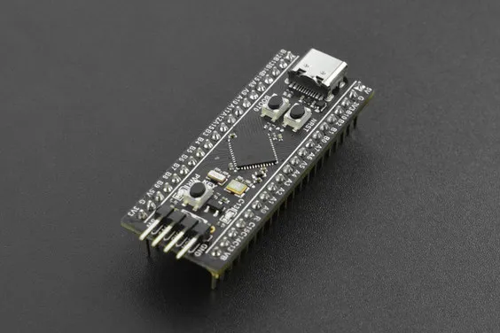
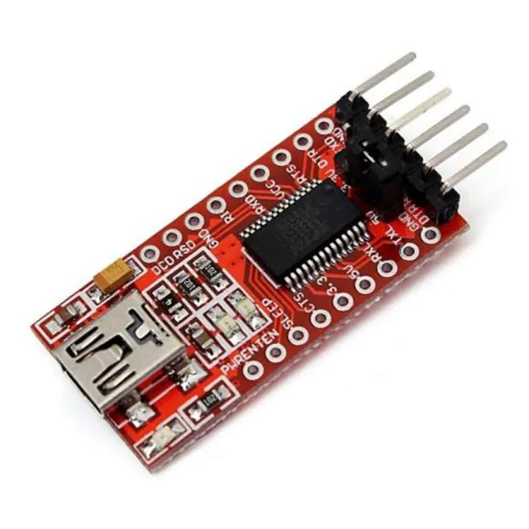
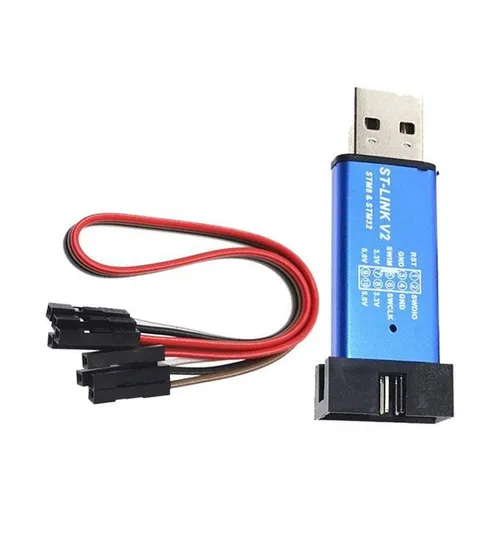
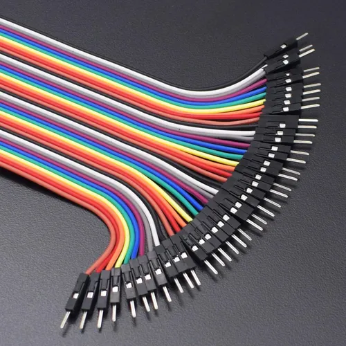
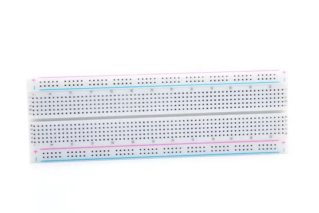

# Table of Contents

1.  [CMSIS STM32 Programming](#org7ca71c5)
    1.  [Hardware Requirements](#org0db8be5)
        1.  [Hardware](#org7c5b7a2)
        2.  [Software](#org053e9f7)
    2.  [Software setup on Arch Linux](#orgba859bd)
    3.  [Build & Flash](#org7af6963)

# CMSIS STM32 Programming

## Hardware Requirements

### Hardware

1.  [Blackpill](https://stm32world.com/wiki/Black_Pill) clone (STM32F401CCU6)

    

2.  RS232 FTDI module and usb-cable if needed

    

3.  st-link v2 clone

    

4.  jumper wires

    

5.  breadboard

    

### Software

1.  [GNU Arm Embedded Toolchain](https://developer.arm.com/downloads/-/gnu-rm)

2.  [st-link](https://github.com/stlink-org/stlink)

3.  [STM32CubeF4 Library](https://github.com/STMicroelectronics/STM32CubeF4)

## Software setup on Arch Linux

Install needed packages

    sudo pacman -S make unzip gcc-arm-none-eabi-bin stlink

Download the standard peripheral library from [st.com](https://www.st.com/en/embedded-software/stsw-stm32065.html)

    git clone https://github.com/STMicroelectronics/STM32CubeF4

The cloned folder is the `STM_COMMON` directory referenced in the `Makefile`

Done.

## Build & Flash

Edit the `Makefile` variables as needed.

`STM_COMMON` should point to the cloned repository.

    make build
    make burn

